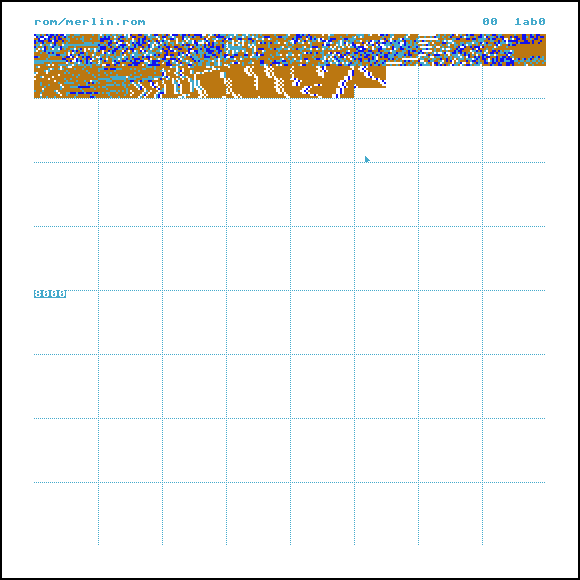

# Merlin OS — Version 0.e (18M06)


<div align="center">
	
</div>

## Varavara's Uxntal Operating System

Memory is organized as follows:

```
0000   0100       @heap         @heap-ptr       @syms-ptr      fc00         ffff
|      |          |             ^               ^         @syms|@buffs         |
v ZPpt v          v             |               |              v @input @ptr   v
+--^---+----------+-------------*---------------*--------------+-v------^------+
| <ZP> | <kernel> | <user code> | <free memory> | <syms table> | | <input buf> |
+--*---+----------+-------------*---------------*--------------+-+------*------+
|==>   |##########|=============>               <==============|#|======>
 (256B)                        ( growth direction )                   (1Kb)
```

# Operator Interaction

```
       Merlin CLI REPL
   █▄  Version 0.8 (06/06/2024).
 ▐ █ ▌ Concatenated Interpretive Uxntal JIT Assembler.
  ▀█   ©MMXXIV Ismael Venegas Castelló, MIT License.
       57865 bytes free (bytecode: 0, symbols: 1331 bytes used).

uxn> #2a18 DEO
*
WST 00 00 00 00 00 00 00 00 00 00 00 00 00 00 00 00|<
RST 00 00 00 00 00 00 00 00 00 00 00 00 00 00 00 00|<

uxn> @star #2a18 DEO JMP2r

WST 00 00 00 00 00 00 00 00 00 00 00 00 00 00 00 00|<
RST 00 00 00 00 00 00 00 00 00 00 00 00 00 00 00 00|<

uxn> star
*
WST 00 00 00 00 00 00 00 00 00 00 00 00 00 00 00 00|<
RST 00 00 00 00 00 00 00 00 00 00 00 00 00 00 00 00|<

uxn>
```

## Under the Hood

A parent label starts assembly mode, this will do the following:

1. Assemble the input buffer and place the code after the current position
   of `@here`, and update the `@here` pointer.
2. Add an entry to the "dictionary" ("header" format still under design) and
   update it's pointer.

**Note**: `[` and `]` allow multiline input.

```
uxn> @star ( -- ) [
...   [ LIT2 "* -Console/write ] DEO
...   JMP2r
... ]

WST 00 00 00 00 00 00 00 00 00 00 00 00 00 00 00 00|<
RST 00 00 00 00 00 00 00 00 00 00 00 00 00 00 00 00|<

uxn> star
*
WST 00 00 00 00 00 00 00 00 00 00 00 00 00 00 00 00|<
RST 00 00 00 00 00 00 00 00 00 00 00 00 00 00 00 00|<

uxn>
```

**Doubts**:
* `star` JSI semantics (but not syntax) will need to be adapted to jump
to an absolute address in REPL mode?
* How to allow multiline input without using `[ ]`?

### `@here`

The assembled code area will be concatenated as if assembling Uxntal normally.

```
| @here ( 1337 )
| a0 2a 18 17 6c  ( #2a18 DEO JMP2r )
|
∨ @here ( 133c )
```

### `@dict`

The dictionary will grow in the contrary direction at a constant size for each
entry. Instead of a linked list in tipycal Threaded Interpretive Languages
(TILs), concatenating in inverse order to an array. When searching for a routine
searching from **last entry** to first as done by TILs is accomplished by
starting the search from the "physical beginning" of the array, where the
current `@dict` pointer points to.

```
∧ @dict ( ????-n entry bytes )
|
| identifier                           addr
| s  t  a  r  ( pad to n max bytes )   1337
| 73 74 61 72 00 00 00 00 00 00 00 00  13 37
| @dict ( ???? )
| ( primitives )
```

## ANSI Control Codes

| Feature             | Code |
|---------------------|------|
| Secondary color     |   2  |
| Itallic             |   3  |
| Underline           |   4  |
| Blinking            |   5  |
| Inverted background |   7  |
| Hidden              |   8  |
| Striked through     |   9  |

### Support

|             Environment               | 2 | 3 | 4 | 5 | 7 | 8 | 9 |
|---------------------------------------|---|---|---|---|---|---|---|
| *Windows 11 (__22631.3880__)</br> Windows Terminal (__1.20.11781.0__) </br> WSL2 (__2.2.4.0__) </br> Ubuntu (__22.04.4 LTS__) </br> dash (__0.5.11+git20210903+057cd650a4ed-3build1__)* | X | X | X | X | X | X | X |
| *Windows 11 (__22631.3880__) </br> Chrome Browser (__126.0.6478.182__) </br> Developer Tools*     |   | X | X |   | X |   | X |


## Reasoning

Concatenating instead of threading the routines allows for the usage of Uxntal
and not another Uxntal like language with new or different syntax though some
semantics may need to be adapted.

```
uxn> [
...   @<pdec> ( dec* -- )
...     DUP #64 DIV <pnum>/try
...     DUP #0a DIV <pnum>/try
...     ( >> )
...
...   @<pnum> ( num* -- )
...     #0a MOD [ LIT "0 ] ADD .Console/write DEO
...     JMP2r
...
...     &try ( num* -- )
...       DUP ?<pnum>
...       POP JMP2r
... ]

WST 00 00 00 00 00 00 00 00 00 00 00 00 00 00 00 00|<
RST 00 00 00 00 00 00 00 00 00 00 00 00 00 00 00 00|<

uxn> #002a <pdec>
42
WST 00 00 00 00 00 00 00 00 00 00 00 00 00 00 00 00|<
RST 00 00 00 00 00 00 00 00 00 00 00 00 00 00 00 00|<

uxn>
```

In this case calling `<pdec>` would fall through to `<pnum>` body as in normal
Uxntal, something that would not be possible with a tipical threaded
implementation.

# Drifblim VS drifloon

## Zero Page
- Drifblim uses Console and File, drifloon only Console.
- loon uses `@token $2` while blim uses `@token $1 buf $30`.

## on-init
- loon uses `<assemble>` and `<read>`.
- blim uses only `<assemble>` on files.

## TODO

- [x] Return to repl when when evaluating break `BRK` expression, by pressing
      Enter 3 times.
- [x] `#foo!` should be a Number error (fixed in drifblim).
- [x] Fix `key` routine.
- [x] Reinstate include rune.
- [x] Refactor into something better the file hierarchy.
- [x] Implement log level.
- [x] Fix lambda syms, not being the same as with uxnasm.
- [x] Implement library path. (not possible due to sandbox)
- [x] Make rom smaller (no unused space in between code/data).
- [x] Make multiline more robust.
- [ ] Reset symbols and heap after expression evaluation.
- [ ] Fix memory usage.
- [ ] Add print strings with underscore as spaces routine.
- [ ] Clear heap and symbols after error.
- [ ] Reset PC after absolute padding expression.
- [ ] Keep trak of ZP pointer.
- [ ] Check memory limits ZP, input buffer, head and tail, before writing.
- [ ] Log session.
- [ ] Make multiline more robust with rlwrap.
- [ ] Use walkcomment and allow nesting.
- [ ] Make `pmem` take the lenght to dump.
- [ ] Make symbols store code length.
- [ ] Implement macros.
- [ ] Make logging toggleable.
- [ ] `[]`, `{}`, `()` parse these correctly. (take strings into account.)
- [ ] Comment out debugging for release.
- [ ] Remove uneeded experiments.
- [ ] Integrate disassembler.
- [ ] Restore stacks without `:!` when aborting from all errors!
- [ ] Fix: abort early.
```
փ [140e]> snathoue
ERROR: Unknown reference: snathoue in expression.
ERROR: Aborting...
INFO: Assembled expression in 3 bytes.
WST 00 00 00 00 00 00 00 00 00 00 00 00 00 00 00 00|<
RST 00 00 00 00 00 00 00 00 00 00 00 00 00 00 00 00|<

փ [140e]> #23434
ERROR: Number #23434 in expression.
ERROR: Number #23434 in expression.
ERROR: Aborting...
INFO: Assembled expression in 1 bytes.
WST 00 00 00 00 00 00 00 00 00 00 00 00 00 00 00 00|<
RST 00 00 00 00 00 00 00 00 00 00 00 00 00 00 00 00|<
```

- [ ] Show length of padding as well:


```
փ [13fc]> @foo $1
WST 00 00 00 00 00 00 00 00 00 00 00 00 00 00 00 00|<
RST 00 00 00 00 00 00 00 00 00 00 00 00 00 00 00 00|<

փ [13fd]> @bar #01 ,foo STR JMP2r
Assembled bar in 6 bytes.
WST 00 00 00 00 00 00 00 00 00 00 00 00 00 00 00 00|<
RST 00 00 00 00 00 00 00 00 00 00 00 00 00 00 00 00|<
```
- [ ] print own symbols
- [ ] Enable switching in and out of evaluation/caching modes when typing an expression or including a file.
- [ ] `DUP LIT 28 NEQ ?{ #00 ,&comment STR POP BRK }this_is_valid_uxntal!!!!`
- [ ] shouldn't be allowed (leading / creates invalid definition):

```
@/MOD ( a b -- a/b a%b ) [
  DIVk STHk MUL SUB STHr SWP JMP2r
]
  ok
```

## Rom Visualization



## Repository Tree

```
.
|
├── bak
├── bin
├── build.sh
├── config
│   ├── buffers.tal
│   ├── constants.tal
│   ├── data.tal
│   ├── macros.tal
│   ├── options.tal
│   ├── routines.tal
│   ├── startup.tal
│   └── symbols.tal
├── doc
├── etc
├── lib
│   ├── audio
│   │   └── routines.tal
│   ├── console
│   │   └── macros.tal
│   ├── constants.tal
│   ├── control
│   │   └── routines.tal
│   ├── datetime
│   │   └── routines.tal
│   ├── file
│   │   └── routines.tal
│   ├── macros.tal
│   ├── memory
│   │   └── routines.tal
│   ├── mouse
│   │   └── routines.tal
│   ├── ops
│   │   └── macros.tal
│   ├── routines.tal
│   ├── screen
│   │   ├── data.tal
│   │   └── routines.tal
│   ├── signed
│   │   └── routines.tal
│   ├── string
│   │   ├── macros.tal
│   │   └── routines.tal
│   └── system
│       └── routines.tal
├── rom
├── src
│   ├── assembler
│   │   ├── buffers.tal
│   │   ├── data.tal
│   │   ├── generics.tal
│   │   ├── helpers.tal
│   │   ├── primitives.tal
│   │   └── routines.tal
│   ├── debugger
│   │   ├── macros.tal
│   │   └── routines
│   │       ├── after-eval.tal
│   │       └── before-eval.tal
│   ├── lexer
│   │   ├── data.tal
│   │   └── routines.tal
│   ├── logger
│   │   ├── constants.tal
│   │   ├── data.tal
│   │   ├── error
│   │   │   └── abort.tal
│   │   ├── info
│   │   │   ├── multiline-prompt.tal
│   │   │   ├── prompt.tal
│   │   │   ├── stacks.tal
│   │   │   └── summary.tal
│   │   ├── macros.tal
│   │   ├── routines.tal
│   │   └── warn
│   │       └── redefinition.tal
│   ├── merlin
│   │   ├── buffers.tal
│   │   ├── data.tal
│   │   ├── includes.tal
│   │   ├── macros.tal
│   │   └── main.tal
│   ├── repl
│   │   ├── buffers.tal
│   │   ├── data.tal
│   │   ├── macros.tal
│   │   ├── routines.tal
│   │   └── symbols.tal
│   └── tokenizer
│       ├── buffers.tal
│       └── routines.tal
└── test
    ├── macros.tal
    ├── opctest.tal
    ├── routines.tal
    └── script.tal
```
